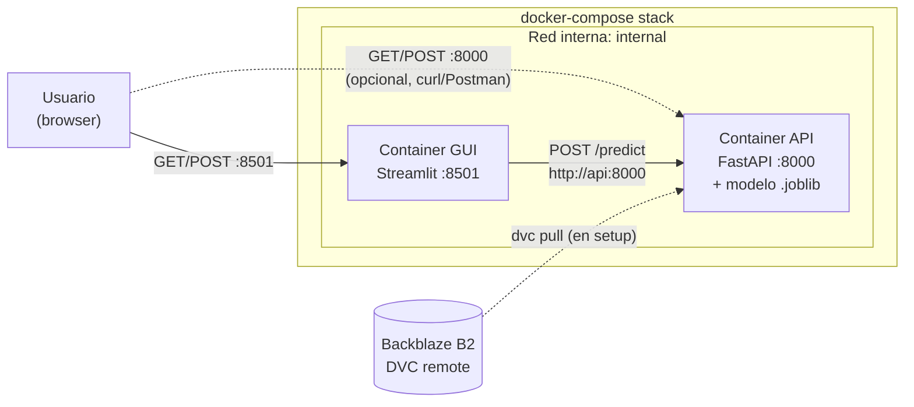

# Entrega 2: Despliegue de inferencia en producción local

**Autor**: Emilio Gómez Lencina
**Proyecto**: AndesLink Servicios Digitales S.A. - Predicción de churn
**Versión del modelo**: v2 (LogisticRegression, threshold calibrado = 0.441444)

## Resumen

La E2 entrega la capa de despliegue del modelo entrenado en E1. El sistema expone la inferencia a través de una API REST con contratos validados (FastAPI + Pydantic) y una interfaz gráfica (Streamlit) que la consume. Ambos componentes corren en containers separados orquestados por Docker Compose, comunicandose internamente y construidos siguiendo patrones de hardening uniforme (multi-stage, usuario no-root, filesystem read-only). El stack completo se levanta con un único `docker compose up -d` y permite tanto consumo interactivo (browser) como tambien usando curl / Postman si se requiriera

## Diagrama de arquitectura



## Componentes del sistema

| Componente | Tecnología | Puerto | Responsabilidad |
|------------|-----------|--------|-----------------|
| API | FastAPI + uvicorn | 8000 | Inferencia, validación de contratos, carga del modelo |
| GUI | Streamlit | 8501 | Formulario, llamadas HTTP a la API, render del resultado |
| Modelo | scikit-learn pipeline (joblib) | n/a | Prediccion de probabilidad de churn |
| DVC remote | Backblaze B2 | n/a | Source of truth del artefacto del modelo (binario fuera de Git) |

Ambos containers se construyen sobre `python:3.11` con multi-stage builds: un `builder` instala dependencias en un venv aislado y un `runtime` minimal que solo carga el venv ya construido, el código de la aplicación y, en el caso del API, el `.joblib` del modelo.

## Flujo de inferencia

1. Se completa el formulario en el browser (`http://localhost:8501`).
2. Streamlit normaliza los tipos del formulario: `np.int64` y `np.float64` que devuelve `number_input` se castean a `int` y `float` nativos de Python para no chocar con la validación `strict=True` del API.
3. La GUI hace `httpx.post('http://api:8000/predict', json=payload)` resolviendo el hostname `api` por el DNS interno de Docker (no `localhost`).
4. Un middleware de la API genera un `request_id` UUID4, lo agrega al header `X-Request-ID` de la respuesta y lo propaga al contexto del logger.
5. Pydantic valida el payload con dos capas de defensa: tipos estrictos sin coerción (`strict=True`), prohibición de campos no declarados (`extra="forbid"`), enums explícitos en español (`Literal["anual", "bianual", "mensual"]`), y rangos de negocio (`tenure_months >= 0 and <= 600`, etc.). Cualquier mismatch devuelve 422.
6. Si la validación pasa, `main.py` construye un DataFrame de una fila, aplica `add_derived_features` (importada del mismo módulo que usó training: `src.features`) y llama a `pipeline.predict_proba`.
7. La probabilidad obtenida se compara contra el threshold calibrado (`0.441444`, inyectado por env var desde el compose) para determinar la clase. La respuesta incluye `churn`, `probability`, `model_version`, `threshold` y `request_id`.
8. La GUI parsea la respuesta, renderiza un badge verde o rojo según la clase, una barra de probabilidad con porcentaje y un expander con la metadata completa para trazabilidad.

## Decisiones de diseño

**Separacion API + GUI en containers distintos**: aislamiento de fallas, posibilidad de escalar cada uno por separado en deployments futuros, hardening específico por servicio y, sobre todo, una arquitectura legible donde cada container tiene una responsabilidad clara y comunicable.

**`add_derived_features` compartida con training**: la función que calcula `charges_per_month` y `tickets_per_year` se importa del mismo módulo `src.features` que usa el pipeline de training. Single source of truth previene training/serving skew, que es la causa más común de bugs sutiles en sistemas ML: el modelo recibe en producción features con una distribución levemente distinta a la del fit y degrada silenciosamente.

**Pydantic `strict` + `Literal` + `extra="forbid"`**: defensa antes de tocar el modelo. Categorías desconocidas, tipos incorrectos o campos extra reciben 422 con mensaje generico (sin leak del detalle interno al cliente). Combinado con el `handle_unknown="ignore"` del `OneHotEncoder` (heredado de E1), constituye una defensa en dos capas.

**Threshold como variable de entorno**: el valor calibrado en E1 (`0.441444`) se inyecta al container vía `docker-compose.yml`, no se hardcodea en el código. Esto permite recalibrar el threshold y redeployar sin rebuildear la imagen, manteniendo el artefacto del modelo intacto. La trazabilidad se preserva porque cada respuesta incluye el `threshold` efectivamente aplicado.

**Hardening uniforme entre ambos servicios**: multi-stage build, usuario de sistema `appuser` sin home y con `/usr/sbin/nologin` como shell, `security_opt: no-new-privileges`, `read_only` filesystem con tmpfs solo en `/tmp`, `mem_limit: 512m`, `cpus: 1.0`. Las dos imágenes aplican el mismo patrón con adaptaciones puntuales (la GUI necesita `HOME=/tmp` para que Streamlit pueda escribir su config interna).

**Healthchecks encadenados (`depends_on: condition: service_healthy`)**: la GUI no arranca hasta que el API termina su lifespan y empieza a responder 200 en `/health`. No es un `sleep` arbitrario: es readiness real. Si el modelo no carga (versión de sklearn incorrecta o `.joblib` ausente), la API falla en startup y la GUI directamente no se levanta, en lugar de quedar a medias.

## Trazabilidad y auditoria

Cada decisión del sistema queda registrada para auditoría posterior:

- **Integridad del modelo**: al startup de la API, `model_loader.py` calcula y loguea el SHA-256 del `.joblib` cargado. Si el archivo se modifica entre deployments, el hash cambia y queda evidencia en los logs.
- **Versión de scikit-learn verificada**: el módulo de carga del modelo compara la versión de sklearn en runtime contra la versión esperada (`1.5.2`). Mismatch produce `RuntimeError` y el container no arranca.
- **`request_id` por inferencia**: UUID4 generado en el middleware, propagado al contexto del logger (loguru) y devuelto en el header `X-Request-ID` y en el body de la respuesta. Permite correlacionar la respuesta vista por el cliente con las líneas del log del servidor.
- **`model_version` y `threshold` en cada respuesta**: el cliente sabe exactamente qué modelo y qué umbral produjeron la predicción, sin tener que consultar configuración externa.
- **Logging estructurado en JSON en producción**: el modo `ENV=production` activa `serialize=True` en loguru, generando una línea JSON por evento. Compatible con cualquier pipeline de log aggregation (en E3 se conectará a la pila de observabilidad).

## Contrato de la API

La API expone dos endpoints HTTP. Acá se documenta el contrato de cada uno con ejemplos ejecutables en bash (`curl`) y PowerShell (`Invoke-RestMethod`).

### GET /health

Devuelve el estado de carga del modelo y la versión de scikit-learn en runtime. Lo usa el healthcheck de Docker Compose para determinar readiness.

```bash
curl http://localhost:8000/health
```

```powershell
Invoke-RestMethod -Uri "http://localhost:8000/health" -Method Get
```

Respuesta (HTTP 200):

```json
{
  "status": "ok",
  "model_loaded": true,
  "model_version": "v2",
  "sklearn_version": "1.5.2"
}
```

Si el modelo no está cargado, devuelve HTTP 503 con `model_loaded: false`.

### POST /predict

Recibe los 15 campos del cliente y devuelve la predicción de churn. Todos los campos son obligatorios y validados por Pydantic con tipos estrictos, rangos de negocio y enumerados explícitos.

**Predicción válida (cliente de bajo riesgo)**:

```bash
curl -X POST http://localhost:8000/predict \
  -H "Content-Type: application/json" \
  -d '{
    "tenure_months": 24, "monthly_charge": 65.5, "total_charges": 1572.0,
    "support_tickets": 2, "late_payments": 1, "avg_monthly_usage_gb": 120.0,
    "contract_type": "anual", "payment_method": "credito",
    "internet_service": "fibra", "region": "centro",
    "has_streaming": 1, "has_security_pack": 0,
    "num_products": 2, "customer_age": 35, "is_promo": 0
  }'
```

```powershell
$body = @{
    tenure_months = 24; monthly_charge = 65.5; total_charges = 1572.0
    support_tickets = 2; late_payments = 1; avg_monthly_usage_gb = 120.0
    contract_type = "anual"; payment_method = "credito"
    internet_service = "fibra"; region = "centro"
    has_streaming = 1; has_security_pack = 0
    num_products = 2; customer_age = 35; is_promo = 0
} | ConvertTo-Json

Invoke-RestMethod -Uri "http://localhost:8000/predict" -Method Post -Body $body -ContentType "application/json"
```

Respuesta (HTTP 200):

```json
{
  "churn": 0,
  "probability": 0.293,
  "model_version": "v2",
  "threshold": 0.441444,
  "request_id": "aea70a23-08c7-46a5-b78d-e7777b4fcb1a3"
}
```

**Validación rechazada (edad fuera de rango)**:

```bash
curl -X POST http://localhost:8000/predict \
  -H "Content-Type: application/json" \
  -d '{"tenure_months": 24, "monthly_charge": 65.5, "total_charges": 1572.0, "support_tickets": 2, "late_payments": 1, "avg_monthly_usage_gb": 120.0, "contract_type": "anual", "payment_method": "credito", "internet_service": "fibra", "region": "centro", "has_streaming": 1, "has_security_pack": 0, "num_products": 2, "customer_age": 150, "is_promo": 0}'
```

Respuesta (HTTP 422):

```json
{"detail": "Invalid input parameters"}
```

El detalle específico del error queda en los logs del servidor (con el `request_id` asociado), no se expone al cliente para evitar leak de información interna del contrato.

## Estructura del repositorio

```
andeslink-churn/
├── app/                          # API FastAPI
│   ├── __init__.py
│   ├── config.py                 # Settings inmutable desde env vars
│   ├── logging_config.py         # loguru JSON en prod, human en dev
│   ├── main.py                   # FastAPI, lifespan, endpoints
│   ├── model_loader.py           # Carga del .joblib con verificación
│   └── schemas.py                # Contratos Pydantic
├── gui/                          # GUI Streamlit
│   ├── __init__.py
│   └── streamlit_app.py          # UI + funciones puras HTTP
├── src/                          # Código compartido con training
│   ├── data.py
│   ├── features.py               # add_derived_features (anti-skew)
│   ├── train.py
│   └── evaluate.py
├── models/
│   └── churn_model_v2.joblib     # DVC-tracked, NO en git
├── tests/
│   ├── conftest.py
│   ├── test_api.py               # 8 tests del API
│   └── test_gui.py               # 10 tests de funciones puras
├── reports/
│   ├── informe_e1.md
│   ├── informe_e2.md             # Este documento
│   └── test_metrics.json
├── Dockerfile                    # imagen del API
├── Dockerfile.gui                # imagen de la GUI
├── docker-compose.yml            # orquestación del stack
├── requirements.txt              # runtime del API
├── requirements-gui.txt          # runtime de la GUI
├── requirements-ci.txt           # CI/CD + tests
├── dvc.yaml / dvc.lock           # pipeline de training versionado
└── README.md                     # instrucciones operativas
```

## Operación del sistema

Las instrucciones operativas de levantamiento del stack (clonado del repo, `dvc pull`, build, acceso) viven en el [README del repositorio](../README.md) para que sean lo primero que ve cualquier persona que llega al proyecto.

La suite de tests (`pytest tests/`) reporta 18 tests verdes: 8 de aceptación contra el API real con modelo cargado vía lifespan, y 10 de las funciones puras de la GUI con `httpx.MockTransport`. Esto cubre happy path, validaciones 422, manejo de errores diferenciado y propagación del `request_id`.
