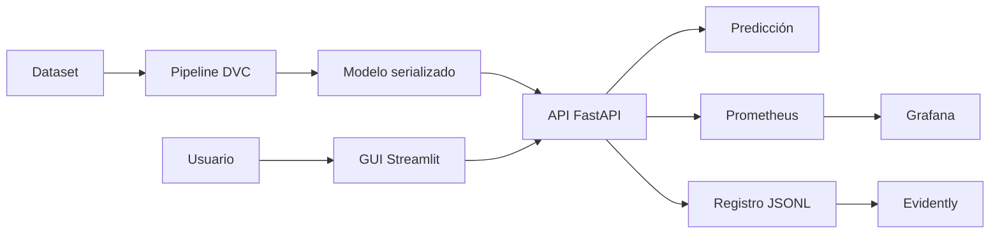
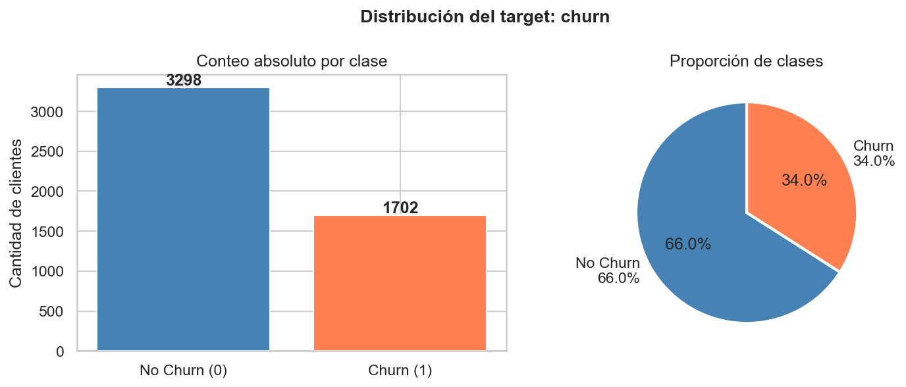
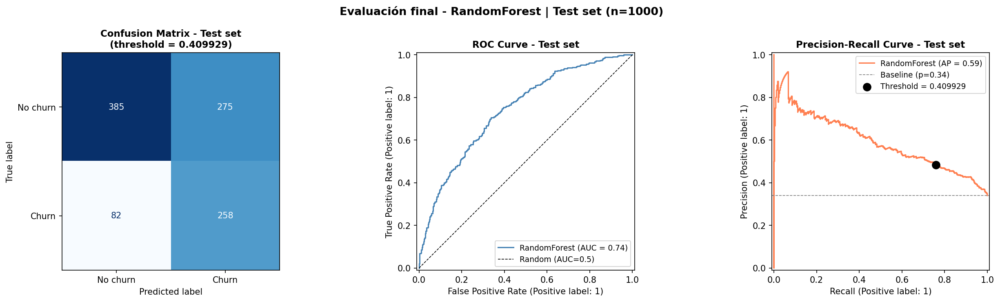
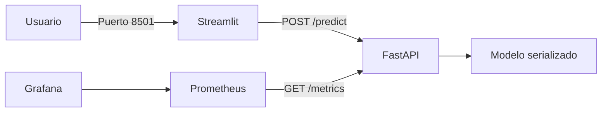

# Proyecto MLOps para predicción de churn - AndesLink Servicios Digitales S.A.
**Materia:** Laboratorio de Minería de Datos  
**Institución:** ISTEA  
**Profesor:** Diego Mosquera  
**Alumno:** Emilio Gómez Lencina  
**Modalidad:** Trabajo individual  
---

## 1. Resumen

El proyecto desarrolla una solución local de MLOps para estimar la probabilidad de churn y cubrir el ciclo completo del modelo:

1. Preparación y análisis de los datos.
2. Entrenamiento y evaluación.
3. Versionado y trazabilidad.
4. Publicación mediante una API.
5. Consumo desde una interfaz gráfica.
6. Despliegue con contenedores.
7. Pruebas automáticas.
8. Monitoreo técnico y de datos.

El resultado (totalmente reproducible) permite entrenar, desplegar, utilizar y monitorear el modelo  de forma autocontenida

---

## 2. Problema y objetivo

El abandono de clientes afecta los ingresos recurrentes y obliga a destinar recursos a la adquisición de nuevos usuarios.
El objetivo analítico es estimar la probabilidad de que un cliente abandone el servicio para priorizar acciones de retención antes de que ocurra la cancelación.

La variable objetivo es `churn`:
- `1`: el cliente abandona el servicio.
- `0`: el cliente continúa activo.
El costo de no detectar a un cliente que se retira se consideró mayor que el costo de contactar a un cliente que finalmente permanece. Por este motivo, la evaluación priorizó un equilibrio entre precision y recall, con especial atención al recall de la clase churn.

---
<br>
<br>
<br>
<br>
<br>
<br>
<br>

## 3. Arquitectura general



Los componentes se encuentran separados por responsabilidad:

| Componente | Función |
|---|---|
| `src/` | Preparación, entrenamiento y evaluación |
| DVC | Reproducción del pipeline |
| MLflow | Registro de experimentos |
| FastAPI | Servicio de inferencia |
| Streamlit | Interfaz para el usuario |
| Docker Compose | Orquestación local |
| Prometheus | Recolección de métricas |
| Grafana | Visualización operativa |
| Evidently | Análisis de calidad y drift |
| pytest y Ruff | Pruebas y controles de calidad |

### 3.1 Criterios de arquitectura

La arquitectura se diseñó separando entrenamiento, inferencia, interfaz y monitoreo. Esta división evita que una modificación en un componente obligue a cambiar todo el sistema.

Al diseñar la estructura tomé cuatro decisiones en particular, que atraviesan la solución completa y responden a mi criterio de ingeniería más que a un requisito de la consigna:

| Decisión | Problema que resuelve | Consecuencia |
|---|---|---|
| Validación estricta del contrato (tipos exactos, categorías cerradas, rangos de negocio) | Datos inválidos llegando al modelo | Los problemas de calidad se vuelven errores 422 visibles; lo único que atraviesa en silencio es el drift |
| Hardening de contenedores (usuario sin privilegios, filesystem de solo lectura, límites de recursos) | Superficie de ataque y escrituras no controladas | La única escritura de la API es el registro de inferencias, y es a proposito. Yo controlo que escribe y que no |
| Identificador de solicitud propagado | Predicciones imposibles de rastrear | Un solo ID correlaciona la respuesta HTTP, el log estructurado y el registro que analiza Evidently |
| Modelo versionado en Git, pipeline en DVC | Dependencia de un remote externo para evaluar | Entrega autocontenida; DVC sigue gobernando datos y entrenamiento |

Otro criterio que se tome es que la API y la GUI se ejecuten en contenedores distintos. La GUI solo se ocupa de recibir datos del usuario y mostrar el resultado, mientras que la API concentra la validación, la carga del modelo y la inferencia. Ambos servicios se comunican mediante el nombre interno `api` dentro de la red de Docker

El monitoreo también se partio en dos:

- Prometheus y Grafana observan el funcionamiento de la API.
- Evidently analiza cambios en los datos recibidos y en el comportamiento de las predicciones.

Docker Compose coordina todos los servicios y permite iniciar la solución completa de forma local

---

## 4. Dataset y análisis inicial

El proyecto utiliza un dataset sintético aportado para el caso de estudio.

| Característica | Resultado |
|---|---:|
| Registros | 5.000 |
| Variables, incluida la variable objetivo | 16 |
| Clientes con churn | 34% |
| Clientes sin churn | 66% |
| Valores faltantes | 0 |

El dataset presenta un desbalance moderado. Por esta razón, accuracy no fue utilizada como única medida de desempeño.

### Hallazgos principales

- Los contratos mensuales presentan mayor tasa de abandono.
- Los contratos anuales y bianuales presentan menor churn.
- Los clientes con menor antigüedad muestran mayor riesgo.
- Una mayor cantidad de tickets de soporte se relaciona con mayor abandono.
- Los pagos atrasados también se asocian con un aumento del riesgo.
- La región no presenta diferencias relevantes.
- `total_charges` es altamente redundante con la antigüedad y el cargo mensual.



---

## 5. Preparación de los datos

Los datos se dividieron de forma estratificada para conservar la proporción de churn.

| Conjunto | Registros | Proporción |
|---|---:|---:|
| Entrenamiento | 3.200 | 64% |
| Validación | 800 | 16% |
| Prueba | 1.000 | 20% |

El conjunto de prueba permaneció separado hasta la evaluación final.

Se crearon dos variables derivadas:

- `charges_per_month`: relación entre cargos acumulados y antigüedad.
- `tickets_per_year`: cantidad de tickets ajustada por el tiempo como cliente.

El preprocesamiento incluye imputación preventiva, normalización de variables numéricas y codificación de variables categóricas. Estas transformaciones se integraron con el clasificador dentro de un pipeline de scikit-learn.

La misma función de ingeniería de variables se utiliza durante el entrenamiento y durante la inferencia. Esto reduce el riesgo de aplicar transformaciones diferentes entre ambos entornos.

---

## 6. Entrenamiento y selección del modelo

Se compararon tres modelos de clasificación:

- Regresión logística.
- Random Forest.
- HistGradientBoosting.

La métrica principal fue F1, porque considera tanto la detección de clientes con churn como las falsas alertas.

| Modelo | F1 en validación | ROC-AUC |
|---|---:|---:|
| Regresión logística | 0.6196 | 0.7544 |
| Random Forest | 0.6209 | 0.7503 |
| HistGradientBoosting | 0.6037 | 0.7461 |

Random Forest obtuvo el mayor F1, pero la diferencia respecto de la regresión logística fue de `0.0013`.

Se definió una tolerancia de `0.005`. Cuando la diferencia entre modelos queda dentro de ese margen, se prioriza la alternativa más simple e interpretable.

Por esta razón, se seleccionó la regresión logística.

---

## 7. Resultado final

El umbral de decisión fue calibrado en `0.441444`, en lugar de utilizar el valor estándar de `0.5`.

El objetivo fue reducir la cantidad de clientes que abandonan el servicio sin ser detectados.

| Métrica en prueba | Resultado |
|---|---:|
| F1 | 0.6020 |
| ROC-AUC | 0.7561 |
| PR-AUC | 0.6155 |
| Precision de churn | 0.4881 |
| Recall de churn | 0.7853 |

El modelo detectó correctamente a 267 de los 340 clientes con churn en el conjunto de prueba.

En términos de BI, permite identificar aproximadamente 8 de cada 10 clientes que abandonan el servicio. Como contrapartida, algunas acciones de retención se dirigirían a clientes que finalmente no canelan el producto. Este balance deberia ajustarse con información real sobre costos comerciales junto con el  equipos de marketing o ventas, por ejemplo.



---

## 8. Reproducibilidad, trazabilidad y versionado de artefactos

El entrenamiento se organizó como un pipeline de DVC:

```text
prepare -> train -> evaluate
```

La configuración se encuentra separada del código mediante `params.yaml`, y la división de datos utiliza una semilla fija.

### 8.1 Criterio de versionado

Git se utiliza para versionar código, configuraciones, pruebas y documentación. Los datasets y los modelos entrenados son artefactos binarios que pueden crecer o cambiar con frecuencia. Guardarlos directamente en el historial de Git suele aumentar el tamaño del repositorio y dificulta su mantenimiento.

Por ese motivo, la decisión inicial fue administrar tanto el dataset como el modelo mediante DVC y almacenarlos en un remote externo. DVC conserva en Git archivos pequeños con las referencias, hashes y dependencias necesarias para recuperar cada versión del artefacto.

La corrección de la segunda entrega señaló una desventaja concreta de esa arquitectura: si el remote no está disponible, no se puede descargar el modelo y el build de la API falla.

Para la entrega final se adoptó una solución intermedia:

- El dataset continúa administrado con DVC.
- El pipeline continúa definido mediante `dvc.yaml` y `dvc.lock`.
- El modelo final se incluye directamente en el repositorio para que el despliegue sea autocontenido.

Esta decisión no elimina el uso de DVC. Mantiene la trazabilidad de los datos y del entrenamiento, pero reduce una dependencia para la evaluación. El modelo es pequeño y estable, por lo que incluirlo en git es aceptable en este contexto academico.

Ya el "mundo real" con entorno productivo, los modelos y datasets se almacenarían normalmente en un repositorio de artefactos, object storage o model registry (como era la solucion original que propuse, DVC + bucket de Backblaze), mientras que Git conservaría el codigo y las referencias.

### 8.2 Herramientas utilizadas

| Herramienta | Uso |
|---|---|
| Git | Código, configuración, documentación y modelo final desplegable |
| DVC | Dataset, dependencias y reproducción del pipeline |
| MLflow | Registro de experimentos |
| Conda | Entorno reproducible |
| scikit-learn | Pipeline de preparación e inferencia |

El modelo final se serializó como `models/churn_model_v2.joblib`. La API lo carga al iniciar y no necesita reentrenarlo para responder solicitudes.

La reproducción del pipeline se realiza con:

```bash
dvc repro
```

## 9. Despliegue, API e interfaz

La solución se despliega mediante Docker Compose. La API, la GUI, Prometheus y Grafana se ejecutan como servicios independientes dentro de una red local.



La API expone los siguientes endpoints:

| Endpoint | Función |
|---|---|
| `GET /health` | Verifica la disponibilidad del modelo |
| `POST /predict` | Devuelve clase y probabilidad de churn |
| `GET /metrics` | Expone métricas para Prometheus |

Pydantic valida tipos, rangos, categorías, campos obligatorios y campos adicionales.

Cada respuesta de predicción incluye:

- Clase predicha.
- Probabilidad de churn.
- Versión del modelo.
- Umbral utilizado.
- Identificador de la solicitud.

La GUI permite ingresar los datos de un cliente, invocar la API y visualizar el resultado sin utilizar herramientas técnicas adicionales.

Los contenedores aplican límites de recursos, sistema de archivos de solo lectura, health checks y ejecución con permisos restringidos.

---

## 10. Monitoreo y observabilidad

El monitoreo se divide en dos planos:

1. Monitoreo técnico del servicio.
2. Monitoreo de los datos y del comportamiento de las predicciones.


### 10.1 Métricas técnicas

La API registra métricas HTTP y métricas propias del modelo.

| Señal | Uso |
|---|---|
| Disponibilidad | Verificar si Prometheus puede consultar la API |
| Requests por segundo | Medir el volumen de tráfico |
| Códigos HTTP | Diferenciar respuestas correctas y errores |
| Latencia HTTP | Observar percentiles p50, p95 y p99 |
| Predicciones por clase | Medir la distribución de resultados |
| Probabilidad de churn | Observar cambios en los scores |
| Latencia de inferencia | Separar el tiempo del modelo del tiempo HTTP |
| Versión del modelo | Identificar el artefacto desplegado |

Prometheus consulta `/metrics` cada 15 segundos. Las series temporales se conservan localmente durante 15 días.

Además de recolectar métricas, Prometheus chequea reglas versionadas en `monitoring/prometheus/rules.yml`. Las recording rules precalculan los indicadores que consume el dashboard, y cuatro reglas de alerta codifican las señales operativas principales: caída de la API, tasa de errores elevada, latencia alta y pico de churn predicho. 

Cada alerta exige que la condición se sostenga durante un período antes de activarse, para no reaccionar ante picos aislados, y su anotación indica la acción correctiva correspondiente.

### 10.2 Dashboard de Grafana

El dashboard se carga automáticamente desde archivos versionados en el repositorio. No requiere configuración manual.

Incluye ocho paneles:

- Disponibilidad de la API.
- Requests por segundo.
- Tasa de errores.
- Proporción de churn predicho.
- Requests por endpoint y código de estado.
- Latencia p50, p95 y p99.
- Predicciones por clase.
- Distribución de probabilidades de churn.

Las consultas PromQL se mantienen dentro de la configuración del dashboard, lo que permite reproducir la misma vista en cada instalación.

### 10.3 Registro de inferencias

Cada predicción se registra en formato JSONL con:

- Fecha y hora.
- Variables de entrada.
- Clase predicha.
- Probabilidad.
- Umbral.
- Versión del modelo.
- `request_id`.

El registro se guarda en `monitoring/data/inferences.jsonl`.

La escritura es de tipo best effort. Si el registro falla, la predicción se devuelve igualmente. De esta manera, el monitoreo no bloquea el servicio principal.


### 10.4 Generación de tráfico

Dos scripts simples ejercitan el sistema:

- `scripts/generate_traffic.py` envía clientes válidos con la distribución de referencia e intercala solicitudes inválidas para generar señal en el panel de errores.
- `scripts/generate_drift.py` envía clientes válidos, pero con distribuciones corridas a propósito.

El escenario de drift modifica principalmente:

- Antigüedad.
- Tickets de soporte.
- Pagos atrasados.
- Cargo mensual.
- Tipo de contrato.

Estas modificaciones representan una población de mayor riesgo y permiten comprobar si el sistema detecta cambios en los datos y en las predicciones.

### 10.5 Reporte de Evidently

Evidently compara:

- Referencia: conjunto de entrenamiento obtenido con el split original.
- Datos actuales: inferencias registradas por la API.

El reporte utiliza `DataDriftPreset` sobre las 15 variables de entrada.

El resultado se guarda en:

```text
reports/drift_report.html
```

En el escenario de prueba, las señales más relevantes corresponden a menor antigüedad, más tickets de soporte, más pagos atrasados, cargos mensuales superiores y mayor presencia de contratos mensuales.

Estas variaciones aumentan la proporción de predicciones de churn. El dashboard permite observar el cambio en tiempo real y Evidently permite identificar qué variables explican la diferencia.

Obviamente que un drift no demuestra una degradación del modelo en este caso. Para medir desempeño real en producción sería necesario recibir posteriormente la etiqueta verdadera de churn.

---

## 11. Criterio de operación

Las acciones correctivas dependen de la señal detectada.

| Señal | Interpretación posible | Acción propuesta |
|---|---|---|
| API no disponible | Falla del servicio o del contenedor | Revisar estado, logs y recursos |
| Latencia elevada | Sobrecarga o degradación operativa | Revisar consumo y tiempos de inferencia |
| Aumento de errores 4xx | Problema de entrada o integración | Revisar el contrato del cliente |
| Aumento de errores 5xx | Problema interno de la API | Revisar logs, modelo y dependencias |
| Aumento de churn predicho | Cambio en la población | Analizar variables con Evidently |
| Drift sostenido | Datos actuales diferentes a la referencia | Validar calidad y evaluar reentrenamiento |

El reentrenamiento no se ejecuta automáticamente. Antes de realizarlo deben verificarse la calidad de los datos, la duración del cambio y su impacto sobre métricas reales.

Varias filas de esta tabla están codificadas como alertas en Prometheus. Por ejemplo. una alerta de pico de churn hace que se tenga que analizar con Evidently.-
---

## 12. Pruebas y controles de calidad

El repositorio incluye 23 pruebas automáticas distribuidas entre:

- API y validaciones.
- Comunicación de la GUI.
- Métricas de Prometheus.
- Registro de inferencias.

También se utiliza Ruff para verificar formato, imports y errores frecuentes.

La integración continua ejecuta el linting y la suite completa de pruebas de forma bloqueante en cada cambio enviado al repositorio.

Por último, `scripts/smoke_monitoring.py` realiza una smoketest end to end sobre el stack levantado: verifica los cuatro servicios, realiza una predicción real y comprueba que quede registrada con su identificador.

---

## 13. Limitaciones

- El dataset es sintético y no representa completamente una operación real.
- No existen resultados reales de campañas de retención.
- El umbral fue calibrado con métricas del modelo y no con costos comerciales.
- El despliegue está diseñado para un entorno local.
- El registro JSONL es adecuado para la demostración, pero debería reemplazarse por un almacenamiento más robusto en producción.
- No se dispone de etiquetas reales posteriores a las predicciones.
- El monitoreo detecta drift de datos y cambios en las predicciones, pero no degradación real del desempeño.
- Los umbrales operativos deberían calibrarse con tráfico y objetivos reales.

---

## 14. Conclusión

El proyecto transforma un modelo de clasificación en una solución local completa y reproducible.

Se logró:

- Analizar y preparar los datos
- Comparar y seleccionar un modelo
- Serializar el pipeline de inferencia
- Reproducir el entrenamiento con DVC
- Registrar experimentos con MLflow
- Publicar el modelo mediante FastAPI
- Construir una interfaz con Streamlit
- Orquestar los servicios con Docker Compose
- Incorporar validaciones y pruebas automáticas
- Recolectar métricas con Prometheus
- Visualizar el sistema con Grafana
- Registrar inferencias y analizar drift con Evidently

Durante este proyecto se logro crear un sistema que puede desplegarse, utilizarse y observarse bajo un enfoque MLOps local.
